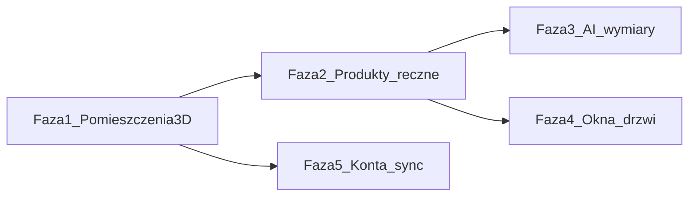
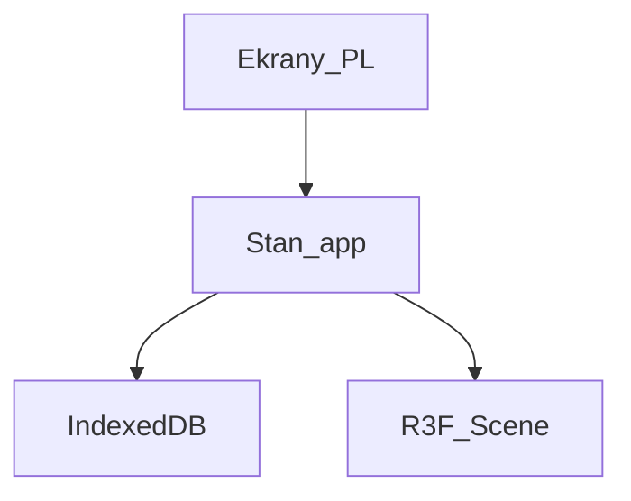

# Homiq — plan dla zespołu

## Cel produktu

Homiq to responsive web app (mobile-first), w której użytkownik buduje proste pomieszczenia w skali, potem ustawia w nich produkty. Marka: **Homiq**. UI: **polski**. Deploy: **Vercel**.

## Decyzje (ustalone)

| Temat | Decyzja |
|--------|---------|
| MVP | Pojedyncze pomieszczenia jako 3D box (L×W×H), bez okien/drzwi/mebli/kolorów |
| Lista | „Moje pomieszczenia” — CRUD osobnych pokoi |
| Edycja wymiarów | Formularz (cm) + tryb „Wymiary” z przeciąganiem ścian; tryb „Podgląd” = orbit |
| Kamera | Orbit z zewnątrz / lekko z góry, pinch zoom |
| Zapis | Lokalnie (IndexedDB); konta + sync później |
| Stack | Next.js (App Router) + TypeScript + React Three Fiber + Drei, Vercel |
| Faza 1 scope | Tylko pomieszczenia; produkty nie wchodzą do pierwszego delivery |

## Roadmapa (poza pierwszym delivery)



- **Faza 2:** Biblioteka „Moje produkty” (nazwa, L×W×H cm, opcjonalna kategoria z listy, opcjonalny link). Stawianie: tap na podłogę, drag, obrót; zawsze na podłodze, w granicach ścian.
- **Faza 3:** AI — URL lub nazwa → propozycja wymiarów → zatwierdzenie → katalog.
- **Faza 4:** Okna i drzwi na ścianach (stary plan Homiq).
- **Faza 5:** Konto + sync w chmurze (migracja z IndexedDB).

## Architektura fazy 1



**Model danych (faza 1):**

```ts
type Room = {
  id: string
  name: string
  lengthCm: number  // X
  widthCm: number   // Z
  heightCm: number  // Y
  createdAt: string
  updatedAt: string
}
```

**Ekrany:**

1. **Moje pomieszczenia** — lista, pusty stan, „Dodaj pomieszczenie”, usuń.
2. **Pomieszczenie** — formularz nazwa/L/W/H, przełącznik Podgląd | Wymiary, canvas 3D, zapis (auto lub przycisk — rekomendacja: autosave przy zmianie).

**3D:** jeden mesh pomieszczenia (podłoga + 4 ściany lub box z otwartą górą), skala 1 unit = 1 cm (albo 1 m z przeliczeniem — w kodzie jedna konwencja, UI zawsze cm). W trybie Wymiary: uchwyty na krawędziach; drag aktualizuje `lengthCm` / `widthCm` i formularz na żywo. Wysokość głównie z formularza (drag wysokości opcjonalnie później).

## Podział na zadania (faza 1)

Zadania da się brać równolegle po scaffoldzie. Zależności: T1 → reszta; T2 przed T3/T5; T4 przed T5/T6.

### T1 — Scaffold i deploy
- Next.js App Router + TS + ESLint, `app/` layout.
- Podstawowy branding Homiq (shell, typografia, CSS variables — bez generycznego „AI purple”).
- Deploy na Vercel (preview + main), README: `npm i`, `npm run dev`, env (na razie brak sekretów).
- **Done:** pusta strona Homiq działa lokalnie i na Vercel.

### T2 — Model + persistence
- Typ `Room`, walidacja (np. min 50 cm, max 2000 cm, nazwa niepusta).
- Warstwa IndexedDB (np. `idb` lub Dexie): `listRooms`, `getRoom`, `saveRoom`, `deleteRoom`.
- Hook / store (np. Zustand) nad tą warstwą.
- **Done:** CRUD pomieszczeń w konsoli / teście bez UI 3D.

### T3 — Lista „Moje pomieszczenia”
- Ekran listy (mobile-first), pusty stan po polsku.
- Dodaj → tworzy room z domyślnymi wymiarami (np. 400×300×270) i otwiera szczegóły.
- Usuń z potwierdzeniem; otwórz istniejące.
- **Done:** pełny flow listy na telefonie bez 3D.

### T4 — Formularz wymiarów
- Pola: nazwa, długość, szerokość, wysokość (cm), błędy walidacji po polsku.
- Dwukierunkowe powiązanie ze store (zmiana w formularzu aktualizuje room + autosave).
- **Done:** edycja i przeładowanie strony zachowuje dane.

### T5 — Podgląd 3D (tryb Podgląd)
- Canvas R3F + OrbitControls (touch).
- Box pomieszczenia zsynchronizowany z `lengthCm/widthCm/heightCm`.
- Responsywny canvas (pełna szerokość, sensowna wysokość na mobile).
- **Done:** zmiana liczb w formularzu zmienia 3D; orbit działa na telefonie.

### T6 — Tryb Wymiary (uchwyty ścian)
- Toggle Podgląd | Wymiary.
- W Wymiary: orbit wyłączony lub zablokowany; uchwyty na ścianach; drag zmienia L/W i formularz.
- Clamp do min/max walidacji.
- **Done:** na telefonie da się zmienić rozmiar uchwytem albo formularzem; tryby się nie gryzą.

### T7 — Szlif UX i QA
- Stany ładowania / błędu storage, dostępność podstawowa, safe-area na iOS.
- Krótki smoke test: dodać 2 pokoje, edytować, odświeżyć, usunąć.
- Uzupełnić README o model danych i konwencję cm ↔ 3D.
- **Done:** checklista QA zaliczona; dokumentacja wystarczy nowemu członkowi zespołu.

## Poza zakresem fazy 1

Produkty, AI, okna/drzwi, konta, PWA install prompt (można dodać później), multiplayer, import rzutu PDF.

## Jak pracować w repo

1. Jedna osoba bierze **T1** i merge’uje jako bazę.
2. **T2** zaraz potem (albo ta sama osoba).
3. **T3** i **T4** mogą iść równolegle na branchach względem T2.
4. **T5** po T4 (potrzebuje wymiarów w store); **T6** po T5.
5. **T7** na końcu / na bieżąco przy review.

Propozycja branchy: `feat/t1-scaffold`, `feat/t2-persistence`, itd., PR → `main`, Vercel preview per PR.
